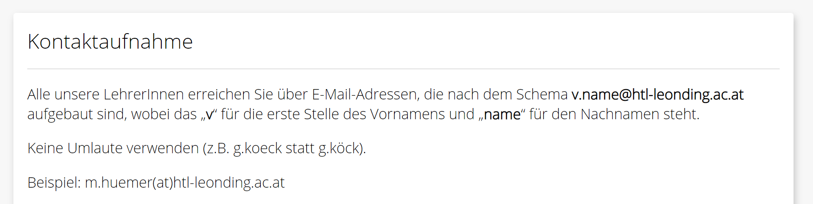
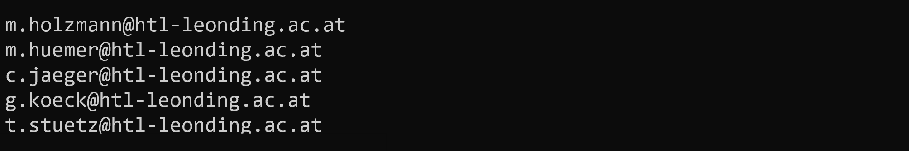

# Mail Addresses

Unter https://www.htl-leonding.at/kontakt/lehrer-innen/finden Sie folgende Information zum Thema Mailadressen.

Erstellen Sie die Datei `app.ts` und implementieren Sie darin folgende Funktionalität:

- Die Datei `teachers.csv` wird eingelesen.
- Jede eingelesene Zeile wird in Vor- und Nachname zerlegt.
- Zu jedem Namen wird die passende Mailadresse ausgegeben.



Für die Ermittlung der Mailadressen ist die Funktion `getMailAddress(firstName, lastName)` zu implementieren:

- Als Parameter werden der Vor- und Nachname übergeben.
- Die Funktion wandelt Vor- und Nachname in Kleinbuchstaben um.
- Die Funktion ersetzt eventuell vorhandene Umlaute (ä = ae, ö = oe, ü = ue).
- Die Funktion generiert die E-Mailadresse nach dem Schema v.name@htl-leonding.ac.at.
- Diese E-Mailadresse wird von der Funktion zurückgegeben.

**Tipps:**

- Für das Zerlegen des eingelesenen Texts ist die String-Methode `split()` hilfreich.

- Mit folgenden Aufruf der String-Methode `replace()` können alle "ä" ersetzten werden:

  ```javascript
  text.replace(/ä/g, 'ae')
  ```

  

